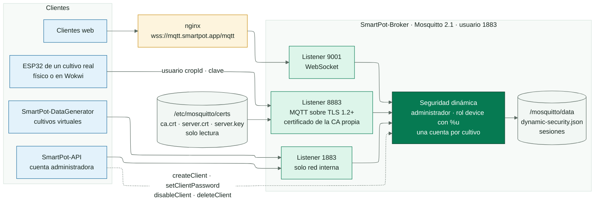
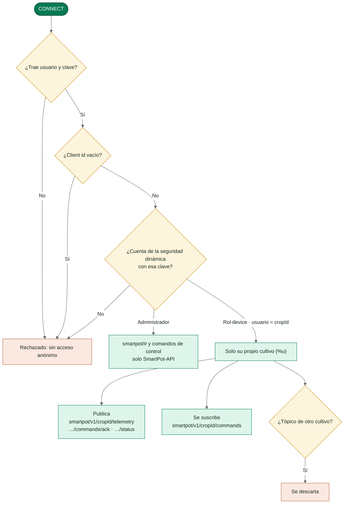
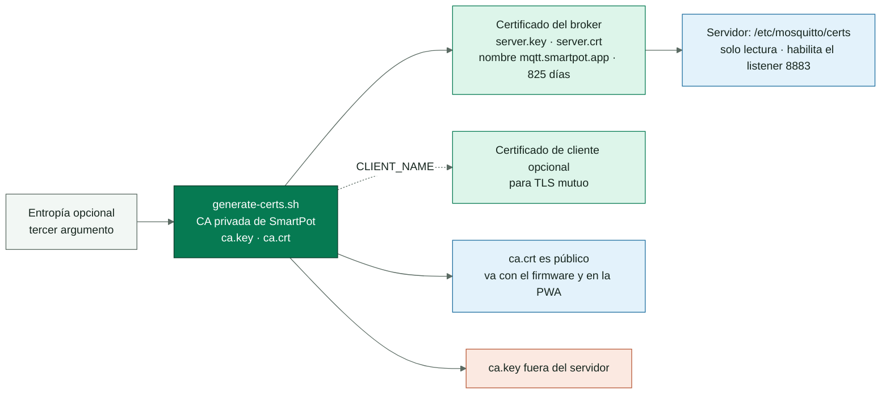

<!-- portada
eyebrow: Documentación del componente
titulo: SmartPot-Broker
acento: Broker
subtitulo: El cartero de los dispositivos
bajada: Mosquitto 2.1 con TLS sobre una CA propia, seguridad dinámica y una cuenta por cultivo: listeners, permisos, certificados, contrato de tópicos, configuración y pruebas.
documento: SmartPot-Broker
version: 1.0 · septiembre 2026
equipo: SmartPotTech
proyecto: smartpot.app
-->

# SmartPot-Broker

## Ficha del documento

| Campo                          | Valor                                                                                                                                                                                                                                                                                                                                                                                                                                                   |
|--------------------------------|---------------------------------------------------------------------------------------------------------------------------------------------------------------------------------------------------------------------------------------------------------------------------------------------------------------------------------------------------------------------------------------------------------------------------------------------------------|
| Proyecto                       | SmartPot · [smartpot.app](https://smartpot.app)                                                                                                                                                                                                                                                                                                                                                                                                         |
| Componente                     | [SmartPot-Broker](https://github.com/SmartPotTech/SmartPot-Broker)                                                                                                                                                                                                                                                                                                                                                                                      |
| Versión                        | 1.0 · septiembre 2026                                                                                                                                                                                                                                                                                                                                                                                                                                   |
| Alcance                        | Listeners, seguridad dinámica, permisos por cultivo, certificados, tópicos, configuración y pruebas                                                                                                                                                                                                                                                                                                                                                     |
| Documentación de la plataforma | [Documentación técnica](https://github.com/SmartPotTech/.github/blob/main/docs/SmartPot_Technical_Documentation.md), [recorrido del proyecto](https://github.com/SmartPotTech/.github/blob/main/docs/SmartPot_Project_Journey.md), [ciclo de vida](https://github.com/SmartPotTech/.github/blob/main/docs/SmartPot_Software_Lifecycle.md) y [diagramas generales](https://github.com/SmartPotTech/.github/blob/main/docs/README.md#diagramas-generales) |
| Mantenimiento                  | Se genera desde `docs/` de este repositorio con las herramientas de `.github/docs/tools`; se actualiza con cada cambio del componente                                                                                                                                                                                                                                                                                                                   |

<!-- parte: PARTE I | El componente -->

## 1. Propósito

### En palabras simples

El broker es el cartero entre los dispositivos y la plataforma. El ESP32 de cada cultivo real, físico o en Wokwi, y el
simulador de los cultivos virtuales publican aquí sus lecturas y reciben sus órdenes; la API escucha y responde. Nadie
entra sin usuario y clave, y cada cultivo solo puede tocar sus propios tópicos.

## 2. Arquitectura del componente

<!-- diagrama: SmartPot_Broker_Global_Component | titulo=SmartPot-Broker por dentro | lamina=H -->

| Listener                   | Uso                                 | Publicación en producción                      |
|----------------------------|-------------------------------------|------------------------------------------------|
| `8883` MQTT sobre TLS 1.2+ | Dispositivos de los cultivos reales | Directo en `mqtt.smartpot.app:8883`            |
| `9001` WebSocket           | Clientes web                        | `wss://mqtt.smartpot.app/mqtt` detrás de nginx |
| `1883` MQTT                | La API y el simulador               | Solo la red interna de Docker                  |

<!-- parte: PARTE II | Seguridad -->

## 3. Permisos por cultivo

<!-- diagrama: SmartPot_Broker_01_Device_Permissions | titulo=Qué puede hacer cada conexión -->

La API es la única cuenta administradora: al arrancar crea el rol `device` y vuelve a crear la cuenta de cada cultivo
desde la base de datos (el broker no necesita respaldo propio); al crear, rotar o borrar un cultivo actualiza su cuenta.
Los cultivos virtuales también tienen cuenta: la usa el simulador.

## 4. Certificados

<!-- diagrama: SmartPot_Broker_02_Certificates | titulo=Certificados del broker -->

El listener TLS solo se habilita si existen `ca.crt`, `server.crt` y `server.key`. `require_certificate` está en
`false`: el dispositivo se autentica con usuario y clave y verifica el servidor con `ca.crt`. Renueva el certificado del
servidor antes de 825 días con la misma CA.

## 5. Tópicos del contrato v1

| Tópico                              | Sentido                                 | QoS |
|-------------------------------------|-----------------------------------------|-----|
| `smartpot/v1/{cropId}/telemetry`    | Dispositivo → API                       | 0   |
| `smartpot/v1/{cropId}/commands`     | API → dispositivo                       | 1   |
| `smartpot/v1/{cropId}/commands/ack` | Dispositivo → API                       | 1   |
| `smartpot/v1/{cropId}/status`       | Dispositivo, retenido y última voluntad | 1   |

<!-- parte: PARTE III | Operación -->

## 6. Configuración

| Variable                                     | Uso                                                                 |
|----------------------------------------------|---------------------------------------------------------------------|
| `MQTT_ADMIN_USERNAME`, `MQTT_ADMIN_PASSWORD` | Cuenta administradora; la clave solo se aplica con el volumen vacío |
| `MQTT_TLS_MAX_CONNECTIONS`                   | Conexiones simultáneas por listener (200 por defecto)               |

Reglas fijas: client id vacío rechazado, sesiones persistentes que vencen una hora después de desconectarse y sin acceso
anónimo.

## 7. Pruebas

`sh tests/smoke.sh smartpot-broker:ci` genera una CA desechable y verifica que la telemetría propia llega, que se
descartan publicaciones y suscripciones a nombre de otro cultivo, que se rechazan claves incorrectas, ids vacíos y
anónimos, y que el listener TLS solo acepta credenciales válidas (10 comprobaciones).

## 8. Operación

| Tarea                              | Cómo                                                                                                                           |
|------------------------------------|--------------------------------------------------------------------------------------------------------------------------------|
| Imagen                             | `ghcr.io/smartpottech/smartpot-broker`: usuario `1883`, solo lectura con `tmpfs` y volumen en `/mosquitto/data`, `HEALTHCHECK` |
| Cambiar la clave del administrador | `mosquitto_ctrl dynsec setClientPassword` o recrear el volumen (la API reaprovisiona los cultivos)                             |
| Despliegue                         | Cada cambio en `main` pasa por el CI, publica la imagen y pide el despliegue central de `.github`                              |
